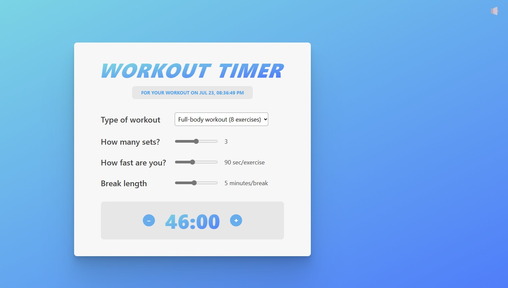

# workout-timer App Challenge 🏃🏻‍♂️

## Features

- useState
- memo
- useMemo
- useEffect
- component composition and reusability

## Screenshots



## Run Locally

Clone the project

```bash
  git clone https://link-to-project
```

Go to the project directory

```bash
  cd my-project
```

Install dependencies

```bash
  npm install
```

Start the server

```bash
  npm start
```

## Acknowledgements

This my finished workout-timer App Challenge 🏃🏻‍♂️ 📌 PART- 3 Challenge - 3 based on A Ultimate React Course by Jonas Schmedtmann
As the description suggests, the original design was done by Jonas Schmedtmann and was part of a Ultimate React Course which I highly recommend. https://www.udemy.com/course/the-ultimate-react-course/

## License

[MIT](https://choosealicense.com/licenses/mit/)
